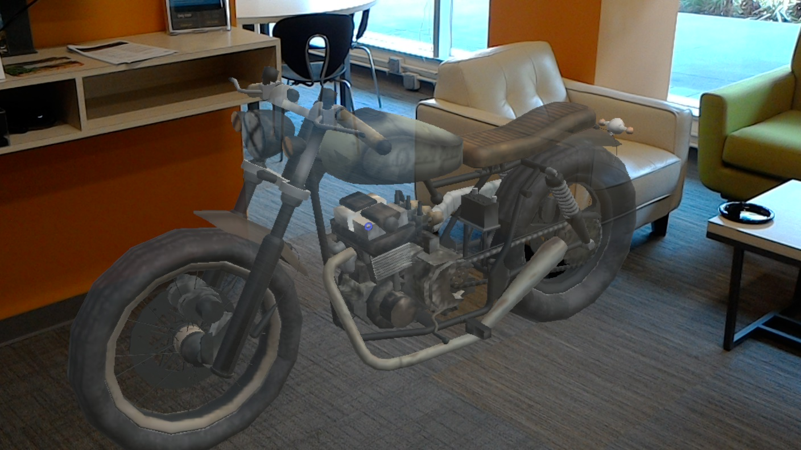
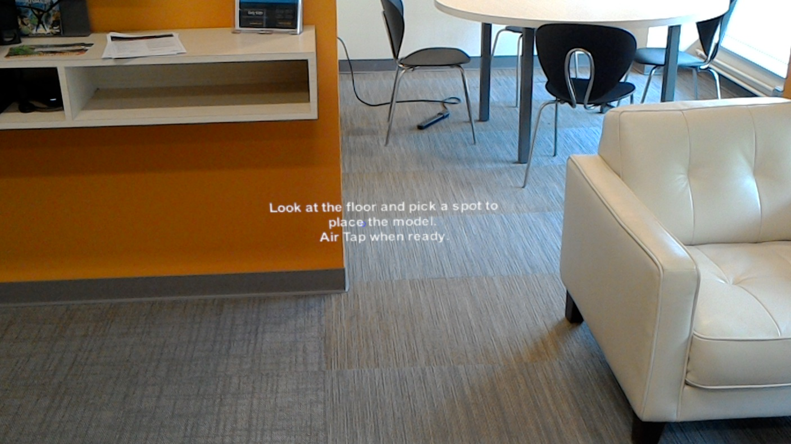

# HoloModelShowcase
This is a Mixed Reality demo project for HoloLens used to showcase a new product in 3D. The goal is to provide a reusable sample to make it easy for companies to create a Mixed Reality experience designed to showcase a new product to potential customers before it is finalized or manufactured.

This is a work in a progress that I am sharing publicly as I add features. 

* **Unity version: 5.6.1f1 Release**
* **HoloToolkit version: 1.5.7**

## Features 

* Synthetic voice (TTS) greets the user, accompanying a text prompt based on a UI canvas, telling them to pick a spot on the floor to place the model.
* Tapping the floor spawns the motorcycle model, accompanied by the engine sound. This is where you could replace the bike with your own model. Make sure the origin of your model is at the bottom.
* You can pair an Xbox One S controller via Bluetooth and use it to spin the bike model around withe the left X axis.
* You can say "*what motorcycle is this?*" and a TTS voice will give you a short blurb about the bike.
* You can say "*enable placing mode*" to go back to the initial state from launch and place the bike at another location.
* You can say "*display mesh*" and "*hide mesh*" to display/hide the spatial mesh. This is for debugging purposes.

## Implementation Notes

* There is nothing preventing you from tapping anywhere in the air and the bike will appear there. I will eventually force the user to tap the floor only.
* More voice commands will be added.

## Screenshots

## Follow Me
* Twitter: [@ActiveNick](http://twitter.com/ActiveNick)
* Blog: [AgeofMobility.com](http://AgeofMobility.com)
* SlideShare: [http://www.slideshare.net/ActiveNick](http://www.slideshare.net/ActiveNick) 
